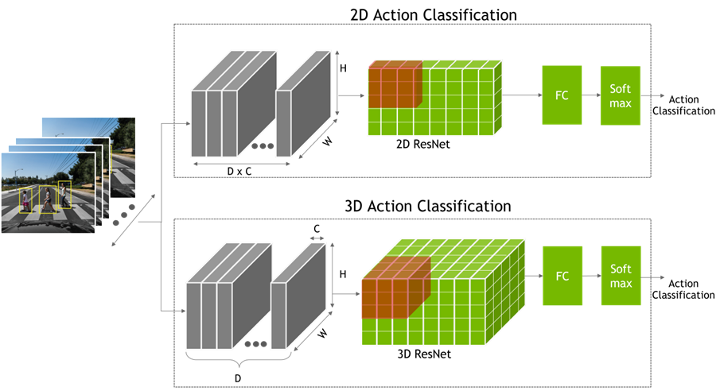
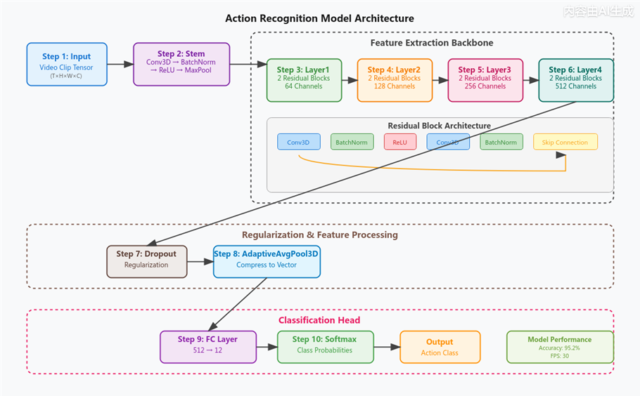
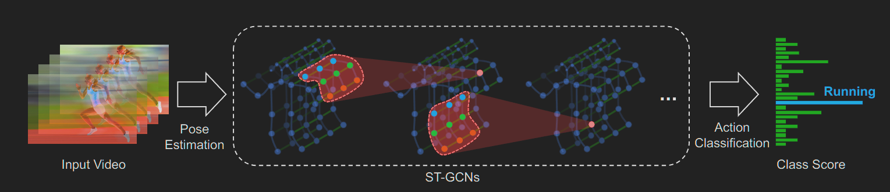
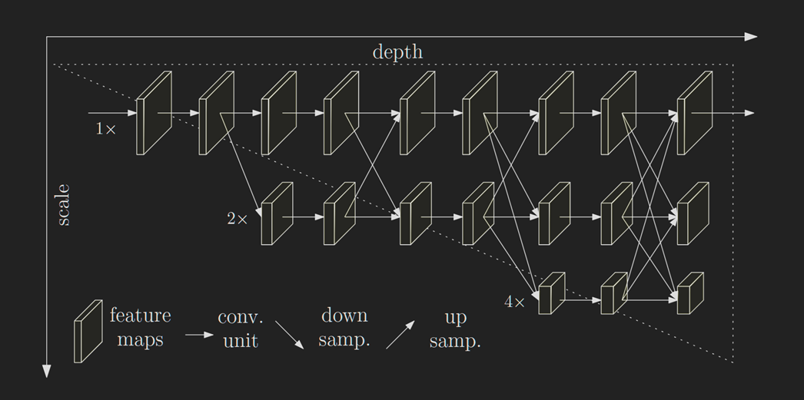
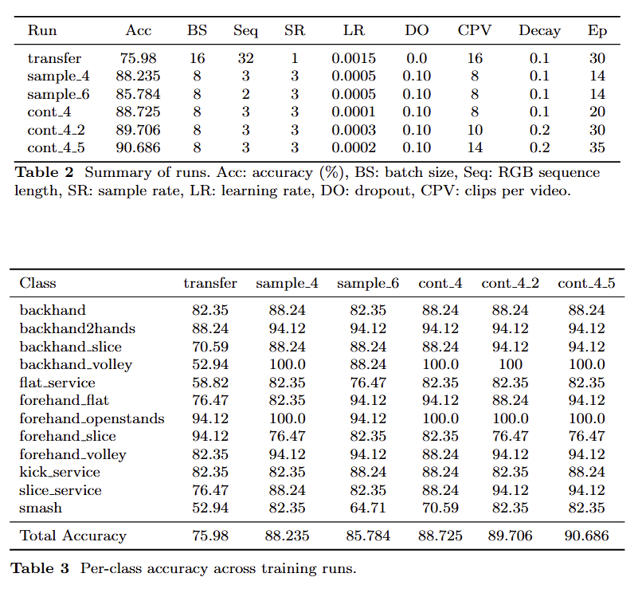

# Tennis Shot Action Recognition with NVIDIA TAO and Deepstream


## Overview

This repository contains deep learning models trained for classification of tennis shots from input videos.


## Project Summary

This project explores the use of NVIDIA TAO Toolkit and DeepStream pipelines to perform tennis action recognition from video using lightweight deep learning models. Two approaches are evaluated: an end-to-end 3D CNN (ActionRecognitionNet) and a skeleton-based pipeline (BodyPose3DNet + PoseClassificationNet). While the 3D CNN achieves strong performance (over 90% accuracy) on the THETIS dataset, the skeleton-based method performs significantly worse, highlighting the importance of visual context such as racket motion. Despite promising training results, real-time inference on live video is less reliable due to dataset limitations and poor generalization, suggesting that model performance is constrained more by data quality than model capacity.


## Architecture Diagrams

<p align="center">
  
  
</p>
<p align="center">
  <em>Action Recognition Net 3D architecture diagrams</em>
</p>

<p align="center">
  
</p>
<p align="center">
  <em>ST-GCN Example Architecture: Backbone for PoseClassificationNet</em>
</p>

<p align="center">
  
</p>
<p align="center">
  <em>HRNet Example Architecture: Backbone for BodyPose3DNet</em>
</p>


## Setup instructions


### Action Recognition Net
For Action Recognition net, install tao tool kit via docker using a legacy API key, run training with the desired YAML file , if needed the pretrained weights used in this project can also be donwloaded from nvidias NGC website.

Once installed open the docker container with this command, adjust command to where taotoolkit is installed:
```bash
docker run --rm -it \
  --gpus all \
  --ipc=host \
  --ulimit memlock=-1 \
  --ulimit stack=67108864 \
  -v /home/garywww/TAO:/workspace/TAO \
  nvcr.io/nvidia/tao/tao-toolkit:6.26.3-pyt bash
```

To run training you can use this command in the container:
```bash
action_recognition train   -e /workspace/path/to/yaml
```

To run evaluation  can use this command in the container:
```bash
action_recognition evaluate   -e /workspace/path/to/yaml
evaluate.checkpoint=/workspace/path/to/ar_model_latest.pth
```
Deepstream real time inference setup was not included for brevity but to use it a custom file modified from the original deepstream_3d_action_recognition.cpp is needed and it needs to copied into the docker container everytime the container opens, the file then needs to be compiled inside the container with a make command. Additionally the config files for deepstreams action recognition is also recommended to be copied out of the container and modified and then copied into the container, the config in the 3 config files should match the training setup for the exported file. 

The general pipeline is train and evaluate the model in tao tool kit, export as onnx file, adjust deepstream config files to match and use the exported onnx file in deepstream for realtime continous inference.

It is recommend to use OBS for the live camera feed and to use VLC media player for output as both input and output functions in the default cpp file are incompatible through wsl due to a known camera issue with tao tool kit and wsl. The CPP file is included in this repo as reference.


### Pose Classification Net

#### Generating skeletons from videos

1. Clone this repo anywhere. 
2. Install deepstream via the docker container from NVIDIA.
3. Follow the instructions for downloading deepstream_pose_estimation from [here](https://github.com/NVIDIA-AI-IOT/deepstream_reference_apps/tree/master/deepstream-bodypose-3d)
4. Start the container and mount you cloned repo that contains the videos you want to process in any subdirectory.

```bash
docker run --gpus all -it --rm \ 
-u root \ 
-v <path to cloned repo>:/workspace \ 
<deepstream container name>
```

5. Copy the deepstream_pose_estimation_claude.cpp file into the container. 

```bash 
cp /workspace/sources/deepstream_pose_estimation/deepstream_pose_estimation_claude.cpp \ 
opt/nvidia/deepstream/deepstream/sources/apps/sample_apps/deepstream_reference_apps/deepstream-bodypo
se-3d/sources/deepstream_pose_estimation_app.cpp
```
Then build the app. 
```bash
make clean
make
```

6. Run the app with this command. 
```bash
mkdir -p /workspace/dataset/skeletons_json/backhand

$BODYPOSE3D_HOME/sources/deepstream-pose-estimation-app \
  --input-dir "<path to your videos you want to process>" \
  --output-dir "<path to where you want the json file to be created>" \
  --output fakesink \
```

#### Converting skeletons into numpy arrays and pkl labels
```bash
python convert_dataset_for_pose_classification.py \
    --input_dir  ./dataset/skeletons \
    --output_dir ./dataset/pose_classification/v1.5_correct-focal-length/ \
    [--focal_length 1200.0] \
    [--max_seq_len 300] \
    [--min_seq_len 10] \
```

#### PoseClassification Inference

1. Download TAO via the docker container ([this image](nvcr.io/nvidia/tao/tao-toolkit:6.26.3-pyt)).
2. Follow setup instructions from nvidia docs. Make sure to mount this repo in the container as workspace/. 
3. Run this bash script to allow pose_classification to run on a different number of classes than the base model (6). (This step is necessary because NVIDIA doesn't expose a way to train/evaluate/infer with pose_classification for a number of classes other than 6).

```bash
python3 << 'EOF'
path = "/usr/local/lib/python3.12/dist-packages/nvidia_tao_pytorch/cv/pose_classification/model/st_gcn.py"
with open(path, "r") as f:
    content = f.read()

old = "model.load_state_dict(pretrained_weights)"
new = """model_state = model.state_dict()
    filtered_weights = {
        k: v for k, v in pretrained_weights.items()
        if k in model_state and v.shape == model_state[k].shape
    }
    skipped = [k for k in pretrained_weights if k not in filtered_weights]
    if skipped:
        print(f"[INFO] Skipping mismatched layers: {skipped}")
    model.load_state_dict(filtered_weights, strict=False)"""

if old in content:
    content = content.replace(old, new)
    with open(path, "w") as f:
        f.write(content)
    print("Patch applied successfully.")
else:
    print("ERROR: Target string not found. Check the exact line with grep.")
EOF
```
4. Run inference. Labels are saved to ```/workspace/results/pose_classification/v2.1/inference/predictions.txt```
```bash
pose_classification inference \
    -e /workspace/specs/pose_classification/v2.1.yaml \
    inference.checkpoint=/workspace/results/pose_classification/v2.1/train/pc_model_latest.pth \
    inference.output_file=/workspace/results/pose_classification/v2.1/inference/predictions.txt \
    inference.test_dataset.data_path=/workspace/dataset/pose_classification/v1.5_correct-focal-length/test_data.npy

```


## CodeBase Map/Repo Structure

```
.
├── Paper/
│   └── Tennis_paper/          # Overleaf / LaTeX paper project (writeup, figures, bibliography, styles)
│
├── images/                    # General images 
│
├── notebooks/
│   └── test.ipynb             
│
├── results/
│   ├── Action_Recognition_Net/   # Training tensorboard and lightning logs (resulting checkpoints and exported models too large to include)
│   └── pose_classification/
│       └── v2.1/                 # Pose classification (versioned experiments)
│
├── scripts/
│   ├── Action_Recognition_Net/   # Data preprocessing script
│   └── pose_classification/      # Scripts for pose pipeline (data conversion, training prep, etc.)
│
├── sources/
│   ├── Action_Recognition_Net/
│   │   ├── configs/              # DeepStream config files (needs to match the models configs)
│   │   ├── labels/               # Label files (class index → class name mapping for inference)
│   │   ├── models/               # Exported models (ONNX model not included because too large)
│   │   ├── temp/                 # C++ source code (modified DeepStream app to be able to use camera and continuos live inference)
│   │   └── videos/               # Test videos used to test inference
│   │
│   └── deepstream_pose_estimation/  # DeepStream-related pose estimation pipeline
│
├── specs/
│   ├── Action_Recognition_Net/   # TAO YAML spec files for training/evaluation
│   └── pose_classification/      # TAO specs for pose classification models
│
├── .gitignore                   
└── README.md                    
```


## Dataset

The data is from the [THETIS dataset](https://github.com/THETIS-dataset/dataset).


## Results summary

<p align="center">
  
</p>
<p align="center">

The experiments show a clear progression in performance driven by key parameter changes. The initial baseline using pretrained weights struggled with certain classes, achieving only around 50% accuracy in some cases. A major improvement came from reducing the RGB sequence length and adding dropout, which increased overall accuracy by about 12% and revealed that training plateaued relatively early. Further experiments confirmed that a short sequence length was optimal, and additional gains were achieved by lowering the learning rate, reducing batch size, and continuing training from a strong checkpoint, which helped push performance beyond the previous ~85% ceiling. Final tuning with short training intervals, slightly higher learning rates, and increased decay allowed the model to surpass 90% accuracy, though with more unstable training behavior compared to earlier runs.


## AI usage summary

LLM and AI usage was primarily used to deal with issues when installing tao tool kit, for example figuring out correct versions, what version of weights are compatible and should be donwloaded, the cli interface commands (as the official documentation was for a different version of toolkit). AI was also used to edit the c backend of deepstream config files, primarily for the purpose of adding a working video source and output source as the fakesink was incompatible. 


### Videos

- 640x480p
- 55 people
- 3 videos per person per shot
- 55 peoples x 3 videos x 12 shots = 1980 videos


### Skeletons

- 34 joints (Nvidia format for PoseClassificationNet)
- Keypoint information stored in json files

